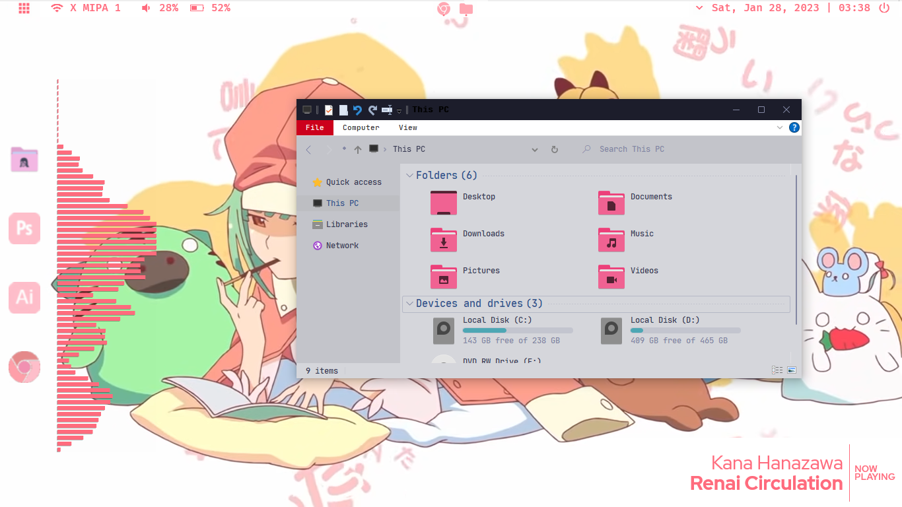

# Pink Nadeko Sengoku
Pink color theme configuration for windows 10/11
<!-- Slideshow container -->

  <!-- Full-width images with number and caption text -->
  

    
1 / 4

    
  

  

    
2 / 4

    
  

  

    
3 / 4

    
  

  
  

    
4 / 4

    
  

  <!-- Next and previous buttons -->
  <a class="prev" onclick="plusSlides(-1)">&#10094;</a>
  <a class="next" onclick="plusSlides(1)">&#10095;</a>

 
<!-- The dots/circles -->

  
  
  
  

# Cara Pasang Tema
 Ada beberapa bagian :

## A. Pasang Aplikasi Rainmeter dan Theme Patcher
1. Buka folder program
2. Pasang aplikasi Rainmeter dan UltraUX pada folder (Klik dua kali, terus ikuti petunjuknya)
3. Restart perangkat jika diminta

## B. Pasang icon
1. Buka aplikasi 7tsp pada folder program
2. Lalu "Add a Custom Pack"
3. Arahkan kepada file 7tsp icon pack
4. Klik "start patching" dan tunggu hingga proses selesai
5. Restart perangkat jika diminta

## C. Pasang Cursor
1. Buka folder Numix Cursor
2. Klik kanan pada file "install.inf" lalu klik Install
3. Pada dropdown "Scheme", pilih "Numix dark"
4. Klik Apply di kanan bawah lalu Ok

## D. Pasang Skin Rainmeter
1. Buka folder rainmeter skin
2. Klik 2 kali untuk memasang skin
3. Klik install pada installer
4. Untuk pengaturan skin rainmeter sesuai selera masing-masing

## E. Pasang Tema Windows
1. Buka folder pink-nadeko-theme
2. Copy semua dalam folder ke C:\Windows\Resources\Themes\
3. Buka Settings > Personalization > Themes
4. Pilih pink-nadeko pada pilihan tema
